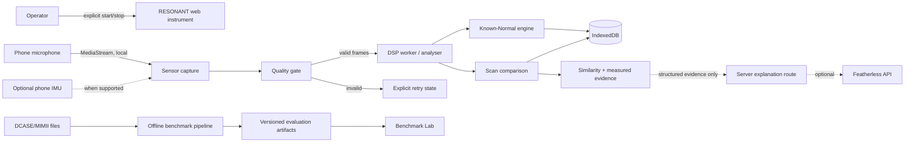

# RESONANT Architecture

## Decision summary

Use a microphone-first, local-processing web architecture. The first real-sensor slice
uses the user-selected Product Design Scientific Strip Chart inside its protected mobile
React/Vite runtime under `app/`. Browser sensors and high-rate Canvas/DSP work stay
outside broad React render state. IMU remains progressive enhancement; optional provider
calls remain deferred behind a future server-only boundary. Benchmark evaluation stays
an isolated Python/offline pipeline and never injects synthetic results into the product path.

The runtime choice changed after visual selection because Product Design's mobile
image-to-code workflow requires its locked Vite runtime for fidelity and QA. The spike
has no server requirement, so this reduces immediate complexity. A server-capable
integrated MVP shell will be re-evaluated only when a verified provider/backend need exists.

## System context

## Trust and execution boundaries

| Boundary | Data crossing | Required control |
|---|---|---|
| Operator → sensors | Permission and capture intent | User gesture, visible active state, explicit stop |
| Browser sensor → processing | Raw microphone/optional motion frames | In-memory local processing; bounded buffers; quality gate |
| Processing → local storage | Features, metadata, baselines, results | Schema validation, versioning, quota/error handling |
| Browser → explanation route | Structured computed evidence | Input schema/size limits; no raw audio; rate limiting |
| Server → Featherless | Evidence prompt and API credential | Server-only key, timeout, safe failure, no impact on anomaly decision |
| Dataset → benchmark runner | External archives and labels | Pinned source/checksum, license/provenance, safe extraction |
| Application → Sentry | Error/diagnostic events | PII/raw-sensor scrubbing; opt-in configuration; disabled without DSN |

## Component boundaries

### Web application

- `app/src/Prototype.tsx` and `app/src/prototype.css`: app-owned instrument composition and visual system.
- `app/src/mobile/`, `app/src/App.tsx`, and associated assets/scripts: protected Product Design preview/runtime contract.
- `app/src/features/sensor/`: capability detection, microphone lifecycle, permission/error mapping, live frame access, and instrument components.
- `app/src/lib/dsp/`: deterministic pure feature calculations and types; no React dependency.
- Future `app/src/workers/`: CPU-bound aggregation only if the spike proves worker need.
- Future storage and machine/baseline/scan/history modules follow stable domain interfaces after the spike.
- A future explanation boundary must be server-only and accept structured evidence only; it is not part of the Vite sensor client.

### Benchmark pipeline

- `benchmark/`: isolated Python environment, manifests, feature/scoring parity tests, evaluation scripts, and generated reports.
- Large datasets remain outside Git. Only manifests, checksums, scripts, compact derived metrics, and plots intended for the submission are versioned.
- Web Benchmark Lab reads committed result artifacts; it never contains hand-entered scores.

### Observability

- Browser and server errors use typed error codes first.
- Sentry is introduced only after the runtime exists and privacy filters are tested.
- Raw audio, full feature vectors tied to personal identifiers, API keys, and user-entered sensitive metadata must not be sent to telemetry.

## Runtime data flow

1. A user selects a machine and operating state.
2. Capability detection verifies secure context, `mediaDevices`, and optional motion interfaces.
3. A user gesture requests microphone access.
4. The capture layer records the actual track settings and creates an `AudioContext`/`AnalyserNode` graph.
5. The quality gate observes real frames and either emits a valid measurement window or a typed retry reason.
6. DSP produces a versioned feature vector and capture metadata.
7. Baseline creation aggregates only valid measurements for that machine, operating state, device context, and pipeline version.
8. A scan is compared with one compatible baseline version; mismatch blocks scoring.
9. The result stores the distance, calibrated similarity representation, changed features, quality summary, and decision status.
10. Optional explanation receives only the structured result. Provider failure leaves the deterministic result intact.

## Data model

Authentication is not justified for the single-device hackathon MVP. `User` is omitted until synchronization or shared inventories are required.

| Entity | Essential fields | Relationships / invariants |
|---|---|---|
| `Machine` | `id`, `name`, optional verified metadata, timestamps | Owns one or more operating states |
| `OperatingState` | `id`, `machineId`, `name`, optional RPM/load notes | Unique within a machine; comparison key |
| `BaselineSession` | `id`, `operatingStateId`, `status`, `pipelineVersion`, device/context metadata, timestamps | Becomes active only after consistency checks pass |
| `BaselineMeasurement` | `id`, `baselineSessionId`, `featureVectorId`, quality result, duration, capture metadata | Must be a real accepted measurement |
| `FeatureVector` | `id`, feature schema version, acoustic features, optional motion features, units | Immutable; schema/version required |
| `Scan` | `id`, `operatingStateId`, `baselineSessionId`, `featureVectorId`, quality result, timestamp | Must reference a compatible active baseline to score |
| `ConditionResult` | `scanId`, raw deviation, calibrated similarity, evidence items, uncertainty, decision | No result when quality or compatibility fails |
| `TrendEvent` | `id`, `operatingStateId`, scan IDs, direction, persistence evidence | Derived from real scan sequence; not a diagnosis |
| `BenchmarkRun` | `id`, dataset manifest, code revision, config, seed, status, artifact paths | Metrics exist only after successful execution |

## State machines

### Measurement

`idle → requesting-permission → initializing → checking-quality → measuring → complete`

Any active state may transition to `denied`, `unsupported`, `interrupted`, `insufficient-quality`, or `failed`. Terminal failure states contain a retry action and never contain a condition score.

### Baseline

`draft → collecting → validating → active`

Invalid outcomes are `insufficient-evidence`, `inconsistent`, `abandoned`, and `superseded`. A new pipeline feature schema supersedes incompatible active baselines rather than silently reusing them.

## Technology selection

| Concern | Selection | Rationale |
|---|---|---|
| Spike app/runtime | Product Design mobile React/Vite runtime + TypeScript | Required selected-design shell; client-only sensing proof with protected runtime QA |
| Package manager | npm | No existing manager; universally available with Node and produces a lockfile |
| Styling | CSS variables/modules initially | Precise instrument styling with minimal dependency surface |
| Live graphics | Canvas 2D | Efficient waveform/spectrum rendering without a chart dependency in the hot path |
| Audio | `getUserMedia`, Web Audio `AnalyserNode` | Standard browser capture and built-in FFT/time-domain access^2 |
| Motion | Device Motion and Generic Sensor adapters | Progressive enhancement behind runtime probes; never required for microphone P0^3 |
| Persistence | IndexedDB | Structured, asynchronous local storage with offline capability; best-effort persistence must be surfaced^4 |
| Benchmark | Isolated Python scientific pipeline | Reproducible dataset evaluation without shipping heavy ML libraries to the phone |
| Explanation | Future server-only boundary → Featherless | Prevents API-key exposure; optional, timeout-bounded, deterministic core remains local^5 |
| Error monitoring | Sentry, deferred | Add only after scrub rules and runtime exist; not a sensing dependency |

## Deployment

- Production and phone testing require HTTPS. `localhost` is acceptable for local development but does not test the phone deployment path.^2
- Use a Node.js-capable provider for full Next.js features; the provider remains **UNKNOWN / NEEDS VERIFICATION** until credentials and deadline constraints are confirmed.
- Required headers include restrictive sensor Permissions Policy after target-browser testing; same-origin top-level operation is the default.
- The application must be usable without Featherless and must clearly surface offline/provider-unavailable states.

## Architecture alternatives considered

### Next.js integrated application

Originally selected to combine client sensing with a later secret-bearing provider route.
Superseded for the spike after the mobile Product Design selection because the protected
Vite runtime is required for faithful implementation and the spike has no server behavior.
Reconsider after the sensor proof rather than maintaining two UI shells.

### Native mobile application

Would offer stronger sensor control but increases packaging, signing, distribution, and platform scope. Deferred to P2; the hackathon requires a broadly accessible demo.

### Python-first server processing

Useful for benchmark work but would upload raw sensor data and make the live demo network-dependent. Rejected for the core sensing path.

## Risk register

| Risk | Severity | Likelihood | Mitigation / validation |
|---|---|---:|---|
| Microphone capture differs across target phones | High | Medium | First spike on real target devices; record actual settings; microphone compatibility matrix |
| Browser processing alters machine signal | High | High | Request disabled AGC/noise suppression/echo cancellation where supported; record actual settings; compare devices |
| IMU unavailable or permission-fragmented | Medium | High | Microphone-only P0; runtime adapter/fallback; no fused score without valid motion |
| Phone placement variability dominates condition change | High | High | Repeatable fixture/protocol; placement guidance; baseline consistency and quality rejection |
| Environmental noise causes false deviation | High | High | Quality check, repeated windows, baseline environment metadata, persistent-trend requirement |
| Too few baseline samples for stable covariance | High | Medium | Feature reduction, diagonal robust scaling first, empirical adequacy study; refuse activation when unstable |
| Operating-state mismatch | High | Medium | Entity-level state key and hard comparison guard |
| Dataset/phone domain mismatch | High | High | Report benchmark and live demo as separate evidence layers; no transfer of performance claims |
| Arbitrary similarity/status thresholds | High | Medium | Calibration protocol from held-out normal and labelled benchmark data; versioned thresholds; unknown until run |
| False positive interpreted as failure | High | Medium | Deviation language, evidence display, persistence logic, monitor/inspect recommendation only |
| Browser storage eviction/data loss | Medium | Medium | Export path P1, persistence request where appropriate, visible storage status |
| Featherless outage or unsafe explanation | Medium | Medium | Deterministic result first, timeout, schema-constrained prompt, no fake fallback |
| Raw data/privacy leakage | High | Low-Medium | Local processing, no raw persistence/upload default, explicit activation, telemetry scrubbing |
| Demo HTTPS/deployment failure | High | Medium | Deploy early; device smoke test; offline-safe core; rehearsed backup device/network |
| Submission deadline missed | Critical | Medium | P0 scope freeze and submission checklist; deadline is 2026-09-13 17:00 EDT^6 |

## Blocking unknowns

- Target phone/browser matrix and physical access for real-device testing.
- Final deployment provider and account access.
- Actual capture settings and processing behavior on the target device.
- Empirically defensible quality/calibration thresholds.

None blocks creating the browser spike; they block claiming that the spike is reliable across devices.

## Sources

1. Product Design bundled `mobile-app` runtime and local prototype contract, inspected 2026-09-13. Context7 documentation for `/vercel/next.js/v16.2.9` was checked earlier for a possible future integrated server boundary; it does not select the spike runtime.
2. MDN Web Docs. [`MediaDevices.getUserMedia()`](https://developer.mozilla.org/en-US/docs/Web/API/MediaDevices/getUserMedia) and [`AnalyserNode`](https://developer.mozilla.org/en-US/docs/Web/API/AnalyserNode). Accessed 2026-09-13.
3. W3C. [Device Orientation and Motion](https://www.w3.org/TR/orientation-event/) and [Generic Sensor API](https://www.w3.org/TR/generic-sensor/). Accessed 2026-09-13.
4. MDN Web Docs. [IndexedDB API](https://developer.mozilla.org/en-US/docs/Web/API/IndexedDB_API) and [Storage quotas and eviction criteria](https://developer.mozilla.org/en-US/docs/Web/API/Storage_API/Storage_quotas_and_eviction_criteria). Accessed 2026-09-13.
5. Featherless.ai. [API overview and common options](https://featherless.ai/docs/api-overview-and-common-options). Accessed 2026-09-13.
6. VoltHacks. [Official rules](https://volthacks.devpost.com/rules). Accessed 2026-09-13.
