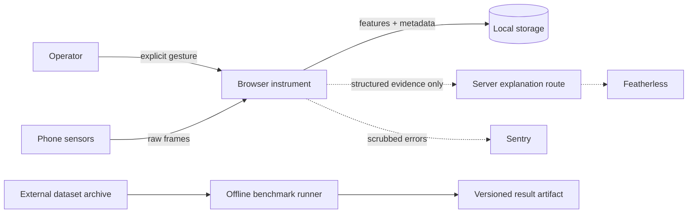

# RESONANT Security and Privacy

## Scope and security objective

Protect microphone/motion access, local machine observations, user-supplied metadata,
optional provider credentials, benchmark files, and the integrity of condition evidence.
The product must fail closed: loss of capability, validation, storage, network, or
provider service never creates a successful-looking measurement or diagnosis.

This threat model covers the planned browser application, local processing/storage,
optional server explanation route, external provider, telemetry, offline benchmark
pipeline, and deployment boundary. No authentication or multi-user synchronization is
part of P0.

## Data classification and handling

| Data | Default location | Retention | External transfer |
|---|---|---|---|
| Raw microphone/motion frames | Browser memory | Discard after bounded processing | Never by default |
| Capture settings and quality | Browser/local feature record | Until user deletion/export | Only explicit structured export |
| Machine and operating-state metadata | Local storage | Until user deletion/export | None in P0 |
| Feature vectors and results | Local storage | Until user deletion/export | Structured evidence only when user requests explanation |
| Provider credentials | Server secret store | Platform-managed | Provider request authentication only |
| Benchmark archives | Developer machine outside Git | Until explicitly removed | Dataset source/download only |
| Error telemetry | Disabled until configured | Provider policy after review | Scrubbed events only; no raw sensor data or secrets |

Raw capture is not persisted or uploaded in the first spike. Any later recording/export
feature requires a separate specification, explicit consent, retention/deletion controls,
size limits, and updated threat review.

## Trust boundaries and assets

Security-critical assets are permission state, active-capture visibility, raw frames,
machine metadata, feature/result integrity, baseline compatibility, API keys, dependency
integrity, dataset provenance, benchmark outputs, and deployment configuration.

## Threat register

| ID | Threat / abuse path | Impact | Current or required control |
|---|---|---|---|
| T01 | Hidden or unexpected microphone activation | Privacy harm, loss of trust | User gesture, visible active state, explicit stop, teardown on exit |
| T02 | Track remains active after stop/navigation/error | Continued recording | Idempotent cleanup; stop all tracks; browser indicator smoke check |
| T03 | Frozen/generated values appear live after interruption | False engineering evidence | Session IDs, freshness state, clear invalidation, no production fallback telemetry |
| T04 | Raw audio leaks through storage, logs, telemetry, or provider prompt | Sensitive-data exposure | In-memory only; payload allowlist; logging/scrubbing tests; no raw upload |
| T05 | Client bundle exposes provider/API secret | Credential compromise | Server-only environment variable; bundle/secret scan; no public prefix |
| T06 | Unvalidated explanation request enables abuse or cost exhaustion | Injection, data exposure, billing | Typed schema, size limits, rate limits, timeout, restricted model/prompt, safe errors |
| T07 | Provider explanation changes or fabricates deterministic result | Misleading condition claim | Provider is optional prose only; deterministic evidence shown first; label provenance |
| T08 | Local record tampering/corruption creates incompatible comparison | False result | Schema/version validation, immutable records, compatibility guard, fail closed |
| T09 | Cross-site scripting reads local observations or triggers actions | Data/permission abuse | Framework escaping, no unsafe HTML, restrictive CSP/headers, dependency review |
| T10 | Malicious/oversized benchmark archive escapes extraction or exhausts disk | Developer compromise/DoS | Pinned source/checksum, safe extraction, size bounds, datasets outside Git |
| T11 | Telemetry captures machine names, full feature vectors, URLs, or secrets | Metadata/privacy leak | Sentry deferred until denylist/allowlist tests pass; environment opt-in |
| T12 | Insecure deployment blocks sensors or weakens transport | Unavailable/unsafe capture | HTTPS, secure headers, deployment smoke test, no insecure bypass |
| T13 | Browser processing changes the acoustic signal invisibly | Invalid evidence | Request preferences only, record actual settings, surface unknowns, cross-device tests |
| T14 | Unauthorized person accesses locally stored history on a shared phone | Confidentiality loss | P0 disclosure and delete-all control before persistent product release; auth deferred |

## Permission and lifecycle requirements

- Never request microphone or motion permission on page load.
- Explain purpose before the request and keep an active indicator plus stop control visible.
- Check secure context and API capability before presenting the action as available.
- Map denied, dismissed, missing-device, constraint, interruption, and processing failures
  to distinct user states.
- Stop tracks, loops, nodes, and contexts on explicit stop, unmount, failure, and stream end.
- IMU permissions and support are separate from microphone capability; IMU absence cannot
  break microphone P0.

## Application and deployment controls

- Validate all server inputs with allowlisted fields, bounded lengths/counts, and explicit
  rejection. Never accept arbitrary provider prompts from the client.
- Configure restrictive Content Security Policy, Permissions Policy, frame protections,
  referrer policy, content-type protections, and HTTPS transport appropriate to the host.
- Keep provider and Sentry configuration optional; missing configuration disables the
  feature rather than exposing a broken success path.
- Do not log request bodies containing sensor evidence or user-entered machine metadata.
- Pin dependencies through the lockfile, review install scripts, and avoid broad upgrades.
- Keep `.env*`, keys, recordings, benchmark archives, local databases, logs, build output,
  and test artifacts ignored.

## Security verification gates

- Unit tests for state invalidation, cleanup, error mapping, schema limits, and baseline compatibility.
- Browser tests for permission denial/unsupported state and stop/navigation cleanup where observable.
- Build-output scan proving no secret name/value appears in the client bundle.
- Dependency audit interpreted for exploitability; findings are not silently waived.
- Header inspection on the deployed HTTPS application.
- Telemetry scrub tests before Sentry is enabled.
- Safe archive/extraction tests before benchmark downloads are automated.
- Final diff and history scan for credentials, recordings, personal paths, and generated junk.

## Review note

The threat inventory was produced using the Codex Security threat-model methodology.
No independent sub-agent review was performed because the current session does not have
user authorization for delegated agents; a second human/security review remains TODO
before final submission.

## Deployment verification status

A private Sites version 2 deployment succeeded at
<https://resonant.shivam-sot010060.chatgpt.site>. It was built from GitHub revision
`06c51e56595abac5919623aba44b60189785a010` and Sites source revision
`16a4f12e70b119122a16798e477dcc73ae1cf0b4`. The project remains owner-only with a
custom audience; no bypass token was generated and access was not broadened.

An unauthenticated request reached the HTTPS edge and returned the expected `401` sign-in
gate with `Referrer-Policy: no-referrer`. That gate response did not expose CSP,
Permissions Policy, HSTS, `X-Content-Type-Options`, or `X-Frame-Options`. Because the
application response is behind ChatGPT authentication, application reachability and its
complete deployed header set remain `UNKNOWN / NEEDS VERIFICATION`; the gate response is
not evidence that the application omits those controls.

## TODO

- Verify deployment-specific application headers from an authorized session and add
  host configuration if the authenticated response lacks required controls.
- Define local export/deletion controls before persistent history ships.
- Define and test the exact explanation-request schema before Featherless integration.
- Add Sentry only after runtime data scrubbing is testable.
- Re-run threat analysis when authentication, synchronization, file upload, or sharing enters scope.

## UNKNOWN / NEEDS VERIFICATION

- Authenticated application response headers, final host header syntax, rate-limit
  mechanism, and secret storage.
- Browser-specific background/suspension cleanup behavior on the physical target devices.
- Whether machine metadata is sensitive in the intended demo/field environment.
